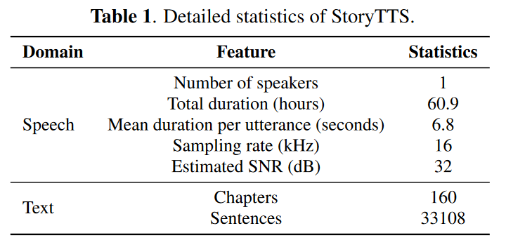
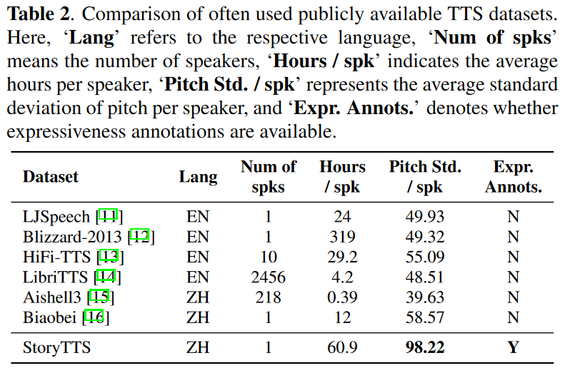

# StoryTTS

> [STORYTTS: A HIGHLY EXPRESSIVE TEXT-TO-SPEECH DATASET WITH RICH TEXTUAL EXPRESSIVENESS ANNOTATIONS](https://ieeexplore.ieee.org/document/10446023)

StoryTTS is a highly expressive text-to-speech dataset that contains rich expressiveness both in acoustic and textual perspective, from the recording of a Mandarin storytelling show (评书), which is delivered by a female artist, Lian Liru(连丽如). It contains 61 hours of consecutive and highly prosodic speech equipped with accurate text transcriptions and rich textual expressiveness annotations.

[Demos](goarsenal.github.io/StoryTTS/)


## Dataset Statistics





## Download

* [Google Drive (5.06 GB)](https://drive.google.com/file/d/1KuD-6c2yxLqPhNJHCaE1jIee-8TjjsB6/view?usp=drive_link)

  ### Note

  * The dataset is **ONLY** for research purposes.
  * Downloading this dataset defaults to agreeing to sign our licensing agreement. lt's important to note that these materials may be removed at any time upon request from the original owner.

## File Description

* `text/transcript` : The transcripts of StoryTTS (**WIP**)
* `text/label` : The annotation labels of StoryTTS (**WIP**)
* `text/prompt_claude2`: Prompt and instruction for Claude2 
* `text/prompt_gpt4`: Prompt and instruction for GPT4
* `text/wav.scp`: Path of wav files

## Citation

```
@inproceedings{storytts,
  author={Sen Liu and Yiwei Guo and Xie Chen and Kai Yu},
  title={{StoryTTS: A Highly Expressive Text-to-Speech Dataset with Rich Textual Expressiveness Annotations}},
  year={2024},
  booktitle={ICASSP 2024 - 2024 IEEE International Conference on Acoustics, Speech and Signal Processing (ICASSP)},
  pages={11521-11525},
  doi={10.1109/ICASSP48485.2024.10446023}
}
```

